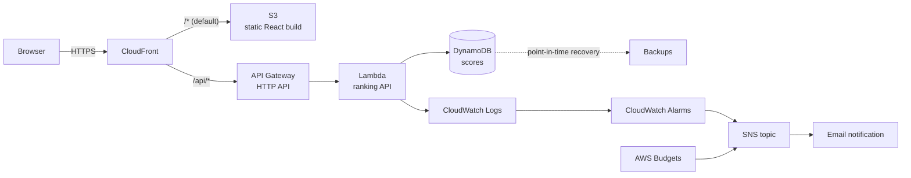

# Lights Out

A Lights Out puzzle game with a persistent score leaderboard, built to be deployed on AWS as a
fully serverless application.

The classic puzzle: a grid of lights where pressing a cell toggles that cell and its four
orthogonal neighbours. The goal is to turn every light off. Boards are generated by applying
random presses to the solved board, which guarantees every puzzle is solvable.

## What it does

- Play Lights Out at three difficulties (3×3, 5×5, 7×7), with a move counter and a timer that
  starts on your first press.
- Submit a finished game under a player name and see the rank it earned.
- Read the leaderboard, filtered by difficulty level, ordered by points.
- A help dialog explaining the rules, the options and how a result reaches the leaderboard.

Points are computed by the server from the reported `moves` and `elapsedMs`, so a client cannot
submit an arbitrary score value. The formula is documented in
[`docs/api-contract.md`](docs/api-contract.md).

## Local development

Requirements: Node.js 22 or newer (see `.nvmrc`).

```bash
npm install
npm run dev
```

This starts both applications:

| Service | URL | Notes |
| --- | --- | --- |
| Web app | http://localhost:5173 | Vite dev server |
| Ranking API | http://localhost:3001 | Local server around the same handlers AWS Lambda runs |

The browser calls `/api/...`, and Vite proxies that prefix to the API dev server **without
rewriting the path**. Development and production therefore use identical URLs, and no rewrite
rule exists anywhere in the stack.

### Commands

```bash
npm run dev            # both applications
npm run dev:api        # ranking API only
npm run dev:web        # web app only
npm run lint           # ESLint, zero warnings allowed
npm run format:check   # Prettier
npm run typecheck      # TypeScript, both workspaces
npm test               # unit tests
npm run test:coverage  # tests with the coverage gate
npm run build          # production build of both workspaces
npm run clean          # remove build output and dependencies
```

## Project structure

```
.
├── apps/
│   ├── api/                 Ranking API: domain, application, ports, adapters, HTTP
│   └── web/                 Vite + React game and leaderboard
├── docs/
│   ├── api-contract.md      Frozen interface between web and api
│   ├── architecture.md      Components, flows and the planned AWS data model
│   └── engineering-standards.md  The binding bar for code and infrastructure
├── terraform/               Infrastructure as code for the AWS stack
├── odd/tasks/               Feature task records
└── .github/workflows/ci.yml CI pipeline
```

The API is layered so that persistence is replaceable:

```
domain/       Scoring rules and validation. Imports nothing outside itself.
application/  Use cases. Depends on domain and on ports only.
ports/        Interfaces, such as ScoreRepository.
adapters/     Implementations. The in-memory repository today, DynamoDB next.
http/         Framework-agnostic router, shared by the Lambda handler and the local server.
```

## Architecture

### Diagram



Request flow for a score submission:

1. The browser POSTs to `/api/scores` on the CloudFront domain.
2. CloudFront routes the `/api/*` path to the API Gateway origin and everything else to S3.
3. API Gateway invokes the Lambda function; no path rewrite is involved.
4. The Lambda handler runs the same router the local dev server runs: it validates the payload,
   computes points server-side, writes to DynamoDB and returns the score with its rank.
5. The response travels back through CloudFront to the browser.

### Architecture decision

This section is required by the assignment and is the most important one in this document.

**Chosen: serverless.** S3 + CloudFront for the frontend, API Gateway HTTP API + Lambda for the
ranking API, DynamoDB on demand for storage.

#### What the product actually demands

The assignment's original premise was "much reading, little writing", which rewards caching and
read scaling. Lights Out has the opposite profile:

- **Spiky, low-volume traffic.** A handful of players, bursts when a link is shared, then nothing.
- **Tiny writes.** One score record per finished game, tens of bytes.
- **Small, ordered reads.** The leaderboard is at most a hundred rows.
- **Idle most of the time.** The expensive thing to pay for is capacity nobody uses.

That profile punishes provisioned, always-on infrastructure and rewards per-request billing.

#### Alternatives considered and why they were rejected

| Alternative | Why it was rejected |
| --- | --- |
| **EC2 behind an ALB with Auto Scaling, RDS PostgreSQL** | The classic answer, and the most instructive one for VPC, ALB and Auto Scaling work. Rejected on cost and fit: an Application Load Balancer bills per hour regardless of traffic, a NAT Gateway costs roughly $33/month for existing, and RDS Multi-AZ — required by the assignment's availability rule — is not covered by the free tier. Realistically $60-90/month to serve a puzzle that gets a few dozen requests an hour. High availability also has to be built by hand: multiple subnets, health checks, Multi-AZ failover. |
| **ECS Fargate behind an ALB, RDS** | Avoids managing instances but keeps the ALB and the database, so it inherits the same idle cost. Adds a container registry, task definitions, service discovery and rolling-deploy machinery that this workload does not need. |
| **API Gateway + Lambda with RDS instead of DynamoDB** | Keeps the compute benefits while reintroducing the cost and the availability work of a relational database. RDS also needs a VPC, which forces either a NAT Gateway or VPC endpoints for Lambda, both of which add cost and complexity. |
| **Self-managed DynamoDB access without a repository port** | Rejected at the code level, not the infrastructure level: persistence sits behind a `ScoreRepository` port so the adapter swap does not touch the application layer. |

#### Why serverless wins here

1. **Cost matches the profile.** Nothing is billed while nobody plays. The estimate below is about
   $0.70/month at realistic hobby traffic and roughly $3/month at ten times that, against
   $60-90/month for the classic stack.
2. **Availability is free and real.** CloudFront, API Gateway, Lambda and DynamoDB are all
   multi-AZ by default. The assignment asks for at least two availability zones for components
   serving production traffic; serverless exceeds that without a single line of Terraform to
   express it.
3. **Backups are a flag.** DynamoDB point-in-time recovery is one attribute and satisfies the
   automatic-backup requirement. RDS needs snapshot windows, retention policy and testing.
4. **Least privilege is expressible.** Each Lambda gets its own role scoped to the specific table
   and the specific actions. There are no instance profiles, no SSH, no bastion, and no
   long-lived database credentials to rotate. The application has **no secrets at all** — a
   meaningful security simplification.
5. **No idle surface to patch.** No operating system, no container base image, no runtime to
   upgrade on a schedule.

#### Trade-offs accepted

- **Cold starts.** A Lambda that has not run recently adds roughly 200-400 ms to the first
  request. For a leaderboard read behind a button press this is imperceptible; for a
  latency-critical API it would not be.
- **Vendor coupling.** The handlers are written against the API Gateway event shape. The domain
  and application layers are not: they are plain TypeScript, which is why the local dev server
  can run them unchanged.
- **Weaker local parity.** DynamoDB is not PostgreSQL. The in-memory repository used in
  development does not reproduce DynamoDB's consistency semantics, so the DynamoDB adapter needs
  its own tests.
- **Less infrastructure to learn.** VPC design, ALB listeners, target groups and Auto Scaling
  policies are genuinely valuable skills that this choice does not exercise. That is a real cost
  of the decision, not a hidden one.

## Cost estimate

Assumptions: a hobby project on a student account, 500 score submissions and 10 000 leaderboard
reads per month, roughly 20 000 static asset requests, under 1 GB of data transfer, no custom
domain, logs retained for 14 days.

| Service | Assumption | Monthly estimate |
| --- | --- | --- |
| CloudFront | ~30 000 requests, < 1 GB transfer | $0.00 (free tier: 1 TB + 10 M requests) |
| S3 | < 1 GB static assets | ~$0.03 |
| API Gateway (HTTP API) | 10 500 requests | ~$0.01 ($1.00 per million) |
| Lambda | 10 500 invocations, 256 MB, ~50 ms | $0.00 (free tier: 1 M requests, 400 000 GB-s) |
| DynamoDB on demand | 500 writes, 10 000 reads, < 1 GB | ~$0.05 |
| DynamoDB PITR | < 1 GB | ~$0.20 |
| CloudWatch Logs | ~200 MB ingest, 14-day retention | ~$0.10 |
| CloudWatch Alarms | 3 alarms | ~$0.30 |
| AWS Budgets | 1 budget | $0.00 (first two budgets are free) |
| ACM certificate | Public certificate on CloudFront | $0.00 |
| Secrets Manager | Not used: the application has no secrets | $0.00 |
| **Total at these assumptions** | | **~$0.70/month** |

The dominant lines are CloudWatch and DynamoDB point-in-time recovery, and neither depends on
traffic. Multiplying every assumption by ten moves the total to roughly **$3/month**: the
per-request lines stay inside the free tiers, and nothing here bills per hour while idle. That is
the shape of the win — the cost tracks usage instead of existing.

Two traps this estimate deliberately avoids: a **NAT Gateway** (~$33/month for existing) and
**CloudWatch Logs with no retention set** (logs accumulate forever and bill forever). Both are
guarded in the standards document.

For contrast, the rejected EC2 + ALB + RDS architecture lands around $60-90/month under the same
traffic.

## Deployment

Infrastructure as code for slice 1a lives under `terraform/`. It deploys the ranking API
(Lambda + API Gateway HTTP API), CloudWatch log retention, two symptom-named alarms with an SNS
email topic, and an AWS Budget. The DynamoDB table, the frontend hosting stack and a push-to-main
CI/CD pipeline are still missing and are listed at the end of this section.

Prerequisites:

- Node.js 22+ and `npm install`.
- AWS credentials configured on your machine. No credentials, account IDs or ARNs are committed;
  the Terraform stack relies on the standard credential chain.
- The state bucket `commit-academy-tf-lo` must exist in `eu-west-1` before the first `init`. It is
  created outside Terraform, as the assignment allows for bootstrap. Only versioning has been
  confirmed by hand so far; check that default encryption and public-access blocking are also on,
  since `encrypt = true` in the backend only covers the state object itself.

Reproducible commands. These have been validated locally with `terraform fmt` and
`terraform validate`; `terraform plan` and `terraform apply` require your credentials and have not
been run in this session:

```bash
npm run build
cp terraform/terraform.tfvars.example terraform/terraform.tfvars
# Edit terraform.tfvars and set owner and alert_email.
terraform -chdir=terraform init
terraform -chdir=terraform plan
terraform -chdir=terraform apply
```

After apply, the `api_health_url` output gives the endpoint to `curl`. API Gateway `auto_deploy`
is enabled, so stage changes publish immediately.

The CI pipeline added in this slice runs `terraform fmt -check -recursive`,
`terraform init -backend=false`, `terraform validate`, plus `tflint` and a security scanner,
without requiring long-lived AWS credentials in the repository.

What is still missing:

1. The DynamoDB table and repository adapter (slice 1b).
2. The frontend hosting stack: S3 origin, CloudFront distribution and origin access control
   (slice 2).
3. The GitHub Actions job that runs `terraform plan` on pull requests and `terraform apply` on
   pushes to `main`.

## Teardown

Once the stack has been applied, remove the application resources with:

```bash
terraform -chdir=terraform destroy
```

The state bucket itself, and any bootstrap resources used by the CI/CD role, must be destroyed
separately. DynamoDB deletion protection and `prevent_destroy` on stateful resources mean that
future teardown will require an explicit, deliberate override rather than a single accidental
command.

## Testing and quality

| Check | Command | Current state |
| --- | --- | --- |
| Lint | `npm run lint` | Passing, zero warnings |
| Format | `npm run format:check` | Passing |
| Types | `npm run typecheck` | Passing, both workspaces |
| Tests | `npm run test:coverage` | 171 tests passing |
| Coverage gate | `npm run test:coverage` | API 87% statements, web 93.8% statements |
| Build | `npm run build` | Passing |

`docs/engineering-standards.md` is the binding bar. Every rule in it carries an ID and the
mechanism that enforces it, so it states only rules that can actually be checked.

## Known limitations

These are real and current, not hypothetical:

- **The score is flat at the top.** Both scoring factors are capped, so any Easy game of six or
  fewer presses finished within 18 seconds scores exactly the maximum of 900, and the same applies
  proportionally at the other levels. Play faster than the reference is not rewarded, which means
  two genuinely different performances can score identically. This is deliberate and postponed, not
  overlooked: removing the flat top means making the maximum asymptotic, which is a product decision
  still to be taken. The contract's scoring section records it.
- **The leaderboard cannot be trusted against a determined cheater.** The server computes points
  from the reported outcome, which prevents submitting an arbitrary score value, but it cannot
  verify that a game was played. A client can report any plausible `moves` and `elapsedMs` pair.
  Closing this needs server-side puzzle state or replay, which is a feature, not a configuration.
- **No authentication.** Player names are self-declared and unverified. Anyone can submit under
  any name.
- **Scores do not persist across a restart.** The repository is in-memory; the DynamoDB adapter
  arrives with the infrastructure work.
- **No anti-abuse controls.** No rate limiting, no captcha, no moderation.
- **Deployment is partially implemented.** The Terraform for slice 1a exists and has passed static
  checks, but it has not been applied against AWS. The DynamoDB adapter, the frontend hosting
  stack and the push-to-main CI/CD pipeline are still missing.

## Roadmap

1. `terraform/`: finish the AWS stack with the DynamoDB table and adapter, CloudFront/S3 hosting,
   and the CI/CD job that runs `terraform plan` on pull requests and `apply` on `main`.
2. Anti-cheat: server-issued puzzle state so a submission can be validated.
3. Accounts, so scores belong to a verified identity.
