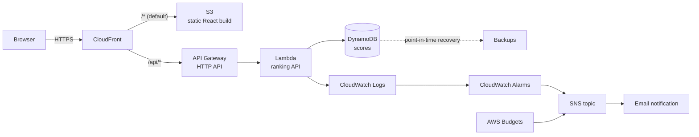

# Lights Out

A Lights Out puzzle game with a persistent score leaderboard, built to be deployed on AWS as a
fully serverless application.

The classic puzzle: a grid of lights where pressing a cell toggles that cell and its four
orthogonal neighbours. The goal is to turn every light off. Boards are generated by applying
random presses to the solved board, which guarantees every puzzle is solvable.

## What it does

- Play Lights Out at three difficulties (3×3, 5×5, 7×7), with a move counter and a timer that
  starts on your first press.
- Submit a finished game under a player name and see the rank it earned.
- Read the leaderboard, filtered by difficulty level, ordered by points.
- A help dialog explaining the rules, the options and how a result reaches the leaderboard.

Points are computed by the server from the reported `moves` and `elapsedMs`, so a client cannot
submit an arbitrary score value. The formula is documented in
[`docs/api-contract.md`](docs/api-contract.md).

## Local development

Requirements: Node.js 22 or newer (see `.nvmrc`).

```bash
npm install
npm run dev
```

This starts both applications:

| Service | URL | Notes |
| --- | --- | --- |
| Web app | http://localhost:5173 | Vite dev server |
| Ranking API | http://localhost:3001 | Local server around the same handlers AWS Lambda runs |

The browser calls `/api/...`, and Vite proxies that prefix to the API dev server **without
rewriting the path**. Development and production therefore use identical URLs, and no rewrite
rule exists anywhere in the stack.

### Commands

```bash
npm run dev            # both applications
npm run dev:api        # ranking API only
npm run dev:web        # web app only
npm run lint           # ESLint, zero warnings allowed
npm run format:check   # Prettier
npm run typecheck      # TypeScript, both workspaces
npm test               # unit tests
npm run test:coverage  # tests with the coverage gate
npm run build          # production build of both workspaces
npm run clean          # remove build output and dependencies
```

## Project structure

```
.
├── apps/
│   ├── api/                 Ranking API: domain, application, ports, adapters, HTTP
│   └── web/                 Vite + React game and leaderboard
├── docs/
│   ├── api-contract.md      Frozen interface between web and api
│   ├── architecture.md      Components, flows and the planned AWS data model
│   └── engineering-standards.md  The binding bar for code and infrastructure
├── terraform/               Infrastructure as code for the AWS stack
├── odd/tasks/               Feature task records
└── .github/workflows/ci.yml CI pipeline
```

The API is layered so that persistence is replaceable:

```
domain/       Scoring rules and validation. Imports nothing outside itself.
application/  Use cases. Depends on domain and on ports only.
ports/        Interfaces, such as ScoreRepository.
adapters/     Implementations. The in-memory repository for local dev, DynamoDB for AWS.
http/         Framework-agnostic router, shared by the Lambda handler and the local server.
```

### Runtime dependencies

The API layer deliberately keeps third-party dependencies to a minimum. Domain and application code
have none. The DynamoDB adapter is the first consumer of AWS SDK packages, so
`@aws-sdk/client-dynamodb` and `@aws-sdk/lib-dynamodb` are the API's first runtime dependencies.
They are required to talk to DynamoDB; no lighter substitute exists for that seam. `esbuild` is a
devDependency used to bundle the Lambda handler into a single `lambda.js`.

## Architecture

### Diagram



Request flow for a score submission:

1. The browser POSTs to `/api/scores` on the CloudFront domain.
2. CloudFront routes the `/api/*` path to the API Gateway origin and everything else to S3.
3. API Gateway invokes the Lambda function; no path rewrite is involved.
4. The Lambda handler runs the same router the local dev server runs: it validates the payload,
   computes points server-side, writes to DynamoDB and returns the score with its rank.
5. The response travels back through CloudFront to the browser.

### Architecture decision

**Chosen: serverless.** S3 + CloudFront for the frontend, API Gateway HTTP API + Lambda for the
ranking API, DynamoDB on demand for storage.

#### Alternatives considered and why they were rejected

| Alternative | Why it was rejected |
| --- | --- |
| **EC2 behind an ALB with Auto Scaling, RDS PostgreSQL** | The classic answer, and the most instructive one for VPC, ALB and Auto Scaling work. Rejected on cost and fit: an Application Load Balancer bills per hour regardless of traffic, a NAT Gateway costs roughly $33/month for existing, and RDS Multi-AZ, which availability needs, is not covered by the free tier. Realistically $60-90/month to serve a puzzle that gets a few dozen requests an hour. High availability also has to be built by hand: multiple subnets, health checks, Multi-AZ failover. |
| **ECS Fargate behind an ALB, RDS** | Avoids managing instances but keeps the ALB and the database, so it inherits the same idle cost. Adds a container registry, task definitions, service discovery and rolling-deploy machinery that this workload does not need. |
| **API Gateway + Lambda with RDS instead of DynamoDB** | Keeps the compute benefits while reintroducing the cost and the availability work of a relational database. RDS also needs a VPC, which forces either a NAT Gateway or VPC endpoints for Lambda, both of which add cost and complexity. |
| **Self-managed DynamoDB access without a repository port** | Rejected at the code level, not the infrastructure level: persistence sits behind a `ScoreRepository` port so the adapter swap does not touch the application layer. |

#### Why serverless wins here

1. **Cost matches the profile.** Nothing is billed while nobody plays. The estimate below is about
   $0.70/month at realistic hobby traffic and roughly $3/month at ten times that, against
   $60-90/month for the classic stack.
2. **Availability is free and real.** CloudFront, API Gateway, Lambda and DynamoDB are all
   multi-AZ by default. Components serving production traffic want at least two availability
   zones; serverless exceeds that without a single line of Terraform to express it.
3. **Backups are a flag.** DynamoDB point-in-time recovery is one attribute and satisfies the
   automatic-backup requirement. RDS needs snapshot windows, retention policy and testing.
4. **Least privilege is expressible.** Each Lambda gets its own role scoped to the specific table
   and the specific actions. There are no instance profiles, no SSH, no bastion, and no
   long-lived database credentials to rotate. The application has **no secrets at all** — a
   meaningful security simplification.
5. **No idle surface to patch.** No operating system, no container base image, no runtime to
   upgrade on a schedule.

#### Trade-offs accepted

- **Cold starts.** A Lambda that has not run recently adds roughly 200-400 ms to the first
  request. For a leaderboard read behind a button press this is imperceptible; for a
  latency-critical API it would not be.
- **Vendor coupling.** The handlers are written against the API Gateway event shape. The domain
  and application layers are not: they are plain TypeScript, which is why the local dev server
  can run them unchanged.
- **Weaker local parity.** DynamoDB is not PostgreSQL. The in-memory repository used by default
  in development does not reproduce DynamoDB's consistency semantics, so the DynamoDB adapter has
  its own integration tests. Setting `SCORES_TABLE_NAME` and `DYNAMODB_ENDPOINT` points the local
  server at DynamoDB Local for higher parity.
- **Less infrastructure to learn.** VPC design, ALB listeners, target groups and Auto Scaling
  policies are genuinely valuable skills that this choice does not exercise. That is a real cost
  of the decision, not a hidden one.

## Cost estimate

Assumptions: a hobby project on a student account, 500 score submissions and 10 000 leaderboard
reads per month, roughly 20 000 static asset requests, under 1 GB of data transfer, no custom
domain, logs retained for 14 days.

| Service | Assumption | Monthly estimate |
| --- | --- | --- |
| CloudFront | ~30 000 requests, < 1 GB transfer | $0.00 (free tier: 1 TB + 10 M requests) |
| S3 | < 1 GB static assets | ~$0.03 |
| API Gateway (HTTP API) | 10 500 requests | ~$0.01 ($1.00 per million) |
| Lambda | 10 500 invocations, 256 MB, ~50 ms | $0.00 (free tier: 1 M requests, 400 000 GB-s) |
| DynamoDB on demand | 500 writes, 10 000 reads, < 1 GB | ~$0.05 |
| DynamoDB PITR | < 1 GB | ~$0.20 |
| CloudWatch Logs | ~200 MB ingest, 14-day retention | ~$0.10 |
| CloudWatch Alarms | 3 alarms | ~$0.30 |
| AWS Budgets | 1 budget | $0.00 (first two budgets are free) |
| ACM certificate | Public certificate on CloudFront | $0.00 |
| Secrets Manager | Not used: the application has no secrets | $0.00 |
| **Total at these assumptions** | | **~$0.70/month** |

The dominant lines are CloudWatch and DynamoDB point-in-time recovery, and neither depends on
traffic. Multiplying every assumption by ten moves the total to roughly **$3/month**: the
per-request lines stay inside the free tiers, and nothing here bills per hour while idle. That is
the shape of the win — the cost tracks usage instead of existing.

Two traps this estimate deliberately avoids: a **NAT Gateway** (~$33/month for existing) and
**CloudWatch Logs with no retention set** (logs accumulate forever and bill forever). Both are
guarded in the standards document.

For contrast, the rejected EC2 + ALB + RDS architecture lands around $60-90/month under the same
traffic.

## Deployment

Infrastructure as code under `terraform/` deploys the ranking API (Lambda + API Gateway HTTP API),
the DynamoDB `scores` table with point-in-time recovery, CloudFront and S3 hosting for the React
app, CloudWatch log retention, two symptom-named alarms with an SNS email topic, and an AWS Budget.
The push-to-main CI/CD pipeline is still missing and is listed at the end of this section.

Prerequisites:

- Node.js 22+ and `npm install`.
- AWS credentials configured on your machine. No credentials, account IDs or ARNs are committed;
  the Terraform stack relies on the standard credential chain.
- The state bucket `commit-academy-tf-lo` must exist in `eu-west-1` before the first `init`. It is
  created outside Terraform.

Reproducible commands. These have been validated locally with `terraform fmt` and
`terraform validate`; `terraform plan` and `terraform apply` require your credentials and have not
been run in this session:

```bash
npm run build
cp terraform/terraform.tfvars.example terraform/terraform.tfvars
# Edit terraform.tfvars and set owner and alert_email.
terraform -chdir=terraform init
terraform -chdir=terraform plan
terraform -chdir=terraform apply
```

`npm run build` must run before `terraform apply` because the Terraform plan uploads the files from
`apps/web/dist`. Without a current build the plan fails with a clear precondition error instead of
deploying an empty site. API Gateway `auto_deploy` is enabled, so stage changes publish immediately.

After apply, open the `app_url` output in a browser. The CloudFront distribution serves the React
SPA from S3 on the default behaviour and forwards every `/api/*` path to API Gateway, so the
deployed frontend talks to the deployed backend on the same origin with no development flag. The
`api_health_url` output gives the endpoint to `curl`; the `scores_table_name`, `scores_table_arn`,
`web_bucket_name` and `cloudfront_distribution_id` outputs expose the created resources.

A new build reaches users without any CloudFront invalidation because Vite emits hashed asset
filenames that change whenever the file contents change. Those objects are immutable and are
cached both at the edge and in the browser for a year. `index.html` is not hashed, so it must
never be cached: CloudFront uses a zero-TTL cache policy for the default behaviour, and the S3
object carries a `Cache-Control: no-cache` header so the browser revalidates it on every request.
The `/api/*` behaviour keeps the existing caching-disabled policy and is untouched. The AWS CLI
is therefore not a runtime dependency of the deployment.

The CI pipeline runs on every pull request and on every push to `main`. Pull requests go
through the `quality` job (lint, format, typecheck, tests with DynamoDB Local, build, secret scan
and dependency audit) and the `terraform` job (`fmt` and `validate`). Neither job needs AWS
credentials, so they stay green even when the lab session has expired.

The `deploy` job runs only on a push to `main`, after both `quality` and `terraform` pass. It
builds both workspaces and then runs `terraform apply -auto-approve`. The build has to run before
the apply because `terraform/web.tf` uploads `apps/web/dist`; a missing directory would deploy an
empty site. The DynamoDB `scores` table carries `prevent_destroy`, so an unattended apply cannot
delete it.

Required repository secrets for the deploy job:

| Secret | Value |
| --- | --- |
| `AWS_ACCESS_KEY_ID` | Temporary lab session access key. |
| `AWS_SECRET_ACCESS_KEY` | Temporary lab session secret key. |
| `AWS_SESSION_TOKEN` | Temporary lab session token. |
| `TF_VAR_owner` | The value of `owner` in your gitignored `terraform/terraform.tfvars`. |
| `TF_VAR_alert_email` | The value of `alert_email` in your gitignored `terraform/terraform.tfvars`. |

These credentials are the lab session's temporary credentials, not long-lived keys. They expire
when the lab session ends, so the deploy job works while the session that produced them is valid
and must be refreshed afterwards. Copy the new values into the repository secrets before the next
push to `main`. Do not commit them.

On a real AWS account you would swap the three `AWS_*` secrets for an OIDC trust between GitHub
Actions and AWS; the provider uses the standard credential chain, so only the workflow's auth step
would change. The Terraform code, the variables and the apply step would stay exactly the same.

The pipeline deploys automatically on push to `main`. It does not run `terraform plan` on pull
requests. It validates, lints and scans the Terraform on every PR, and it applies automatically on
push to `main`.

### Running against DynamoDB Local

For higher local parity, start DynamoDB Local and point the API at it:

```bash
./scripts/start-dynamodb-local.sh
SCORES_TABLE_NAME=lights-out-local-scores DYNAMODB_ENDPOINT=http://localhost:8000 npm run dev:api
```

The integration test suite creates the table itself when DynamoDB Local is reachable; if it is
not, the suite skips with a loud warning, or fails when `REQUIRE_DDB_LOCAL=1` is set.

### Running the dev UI against the deployed API

The Vite dev server forwards `/api` to the local API by default, whose store lives in memory and is
lost on every restart. To exercise the real Lambda and DynamoDB from the development UI instead,
point the proxy at the API Gateway URL, which is the `api_endpoint` Terraform output:

```bash
VITE_API_PROXY_TARGET=https://<api-id>.execute-api.eu-west-1.amazonaws.com npm run dev:web
```

The browser still calls `/api/...`; only the proxy target changes, so no CORS is involved and the URL
the application uses never moves. Verified by posting a score through the dev server and confirming
the item appeared in the DynamoDB table.

With that target the **Clear leaderboard** button wipes the deployed leaderboard for real, because
the purge is unauthenticated by design.

## Teardown

Once the stack has been applied, remove the application resources with:

```bash
terraform -chdir=terraform destroy
```

The S3 web bucket has `force_destroy = true` because it holds only build artifacts that can be
rebuilt from source. The DynamoDB `scores` table has deletion protection and `prevent_destroy`, so
its removal requires an explicit, deliberate override rather than a single accidental command. The
state bucket itself, and any bootstrap resources used by the CI/CD role, must be destroyed
separately.

## Background music and browser autoplay

The game asks the browser to play the music as soon as the page loads, and falls back to
starting it on the visitor's first click, tap or key press. Browsers refuse audible
playback before a visitor has interacted with the site, and a page cannot grant itself
that permission. What follows is how to grant it to this site.

| Browser | Where |
| --- | --- |
| Chrome, Edge (desktop) | The site's **Sound** setting in Site settings, set to Allow. Chrome also permits it once it considers you a regular media consumer of the origin. |
| Firefox | Autoplay settings for the site, allow Audio and Video. |
| Safari (macOS) | Settings, Websites, Auto-Play, Allow All Auto-Play for the site. |
| Safari (iOS) | No user-facing switch; the first tap is required. |
| Local development | Chrome's `--autoplay-policy=no-user-gesture-required` flag, for testing only. |

This is per visitor and per browser, so it cannot be solved in code. A new site cannot
inherit the behaviour of one that already plays automatically either: YouTube is granted
the exemption because the visitor's own history of watching media there crosses Chrome's
Media Engagement Index, and where that does not apply its previews play **muted**, which
is always allowed.

Sources: Chrome's autoplay policy (<https://developer.chrome.com/blog/autoplay/>) and
WebKit's auto-play policy changes for macOS
(<https://webkit.org/blog/7734/auto-play-policy-changes-for-macos/>).

